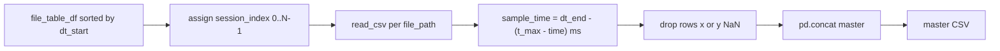

# IOGraph master DataFrame builder

## Context

- Existing work lives in [`IOGraphOutputs.ipynb`](c:\Users\pho\repos\EmotivEpoc\ACTIVE_DEV\pyPhoTimeline\IOGraphOutputs.ipynb) cell 0: `extract_csv_file_datetimes_pandas` produces `results_df` / `IOGraphOutputs_file_table.csv` with `file_path`, `parsed_filename_dt_start`, `parsed_filename_dt_end`.
- Each session CSV has columns **`x`, `y`, `time`** only (verified on Desktop folder).
- `time` is **milliseconds relative to recording start** (0 at first sample; max ~658k–3.9M per file).
- **112 files**, ~18.3M rows total raw; ~9M after dropping NaN `x`/`y` (user choice).

## `sample_time` formula (verified)

Anchor each session’s **last** sample to `parsed_filename_dt_end` so filename end time matches the final event:

```python
t_max = df["time"].max()
df["sample_time"] = parsed_filename_dt_end - pd.to_timedelta(t_max - df["time"], unit="ms")
```

Checks on real files:
- Last row’s `sample_time` equals `parsed_filename_dt_end` exactly.
- `time == 0` maps to `parsed_filename_dt_end - t_max` (first activity in file, not necessarily filename start).

Do **not** use `parsed_filename_dt_start + time` — that only covers ~10–20 min of sparse clicks inside longer filename windows.



## New function (cell 0, below existing extractor)

Add **`build_iograph_master_df`** in the same cell as the parsers (keeps IOGraph logic together):

```python
def build_iograph_master_df(file_table_df: pd.DataFrame, output_csv: Path | None = None, *, drop_na_coords: bool = True) -> tuple[pd.DataFrame, Path | None]:
```

### Steps

1. **Validate** required columns: `file_path`, `parsed_filename_dt_start`, `parsed_filename_dt_end`.
2. **Sort** by `parsed_filename_dt_start` (stable), `reset_index(drop=True)`.
3. **Assign** `session_index = range(len(file_table))` on the table; map into each loaded file.
4. **Loop** `file_path` (sorted order):
   - `pd.read_csv(path)` — read-only on source files.
   - Per-file `t_max = df["time"].max()`.
   - Vectorized `sample_time` from that row’s `parsed_filename_dt_end`.
   - Add metadata columns: `session_index`, `source_file_name` (and optionally `parsed_filename_dt_start` / `parsed_filename_dt_end` for debugging joins).
   - If `drop_na_coords`: `df = df.dropna(subset=["x", "y"])`.
   - Append to list.
5. **`pd.concat(..., ignore_index=True)`** → master DataFrame.
6. **Column order**: `session_index`, `sample_time`, `time`, `x`, `y`, `source_file_name`, (+ optional session bounds).
7. If `output_csv` provided: `master_df.to_csv(output_csv, index=False)` (default path in usage cell: `IOGraphOutputs_master.csv` next to file table).

Return `(master_df, output_csv_path_or_none)` to mirror `extract_csv_file_datetimes_pandas`.

### Edge cases

- Skip / warn on rows with `NaT` in `parsed_filename_dt_end` (should not occur after current parser).
- Files with no valid rows after `dropna` → skip or append empty (log count in notebook output).
- Exclude `IOGraphOutputs_file_table.csv` / `IOGraphOutputs_master.csv` if ever scanned from the table (table is built separately; no change needed if only session paths in table).

## Notebook usage (empty cell 3)

```python
iograph_master_path = iographoutput_path.parent / "IOGraphOutputs_master.csv"
master_df, master_path = build_iograph_master_df(results_df, output_csv=iograph_master_path, drop_na_coords=True)
master_df.head()
```

Optional quick sanity cell: per `session_index`, assert `sample_time.max()` ≈ `parsed_filename_dt_end` and `session_index` is monotonic in time when sorted by `sample_time`.

## Size / performance notes

- ~9M rows post-filter: expect **~200–400 MB** in memory and a **large** CSV on disk. Acceptable for one-off notebook use; if load fails, follow-up could add chunked `to_csv` or Parquet (out of scope unless requested).
- Use a simple `for` loop over 112 files (clear, sufficient); no multiprocessing unless profiling shows need.

## Files touched

- [`IOGraphOutputs.ipynb`](c:\Users\pho\repos\EmotivEpoc\ACTIVE_DEV\pyPhoTimeline\IOGraphOutputs.ipynb): add function in cell 0; wire cell 3 (currently empty).

No new package module unless you later want this in `pypho_timeline/` — notebook-only matches current workflow.
